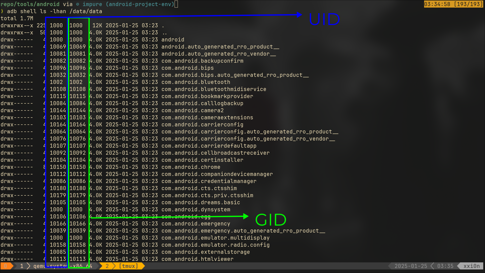

# Android Account Isolation

Android account isolation is a security mechanism that ensures each user account or app runs in its own sandboxed environment, preventing them from accessing other accounts' or apps' data.
- User Accounts: Android supports multiple user profiles (e.g., primary user, guest, or secondary users). Each profile has its own isolated data storage, apps, and settings. This ensures that users cannot access each other's data unless explicitly shared.
- Per-App isolation: Every app runs with a unique Linux UID (User ID) assigned at installation. This creates a sandbox for the app, restricting its access to its own data directory and preventing it from accessing other apps' data or system files.

## Android UIDs and GID allocation
| UIDs / GID | User / use case |
| -------------- | --------------- |
| 0 | root |
| 1 - 999 | OS Use |
| 1000 - 9999 | Device Permission (ex: Bluetooth, etc) |
| 2000 | shell |
| 10000 - 65535 | Application UIDs |

 

Credit:
- https://medium.com/@security.tecno/comprehensive-research-of-android-permission-mechanisms-09f89e6d75d8
- https://medium.com/@itselectlab/how-to-understand-android-uid-2e56468872e3
